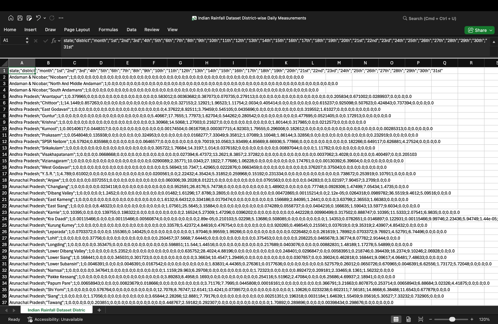
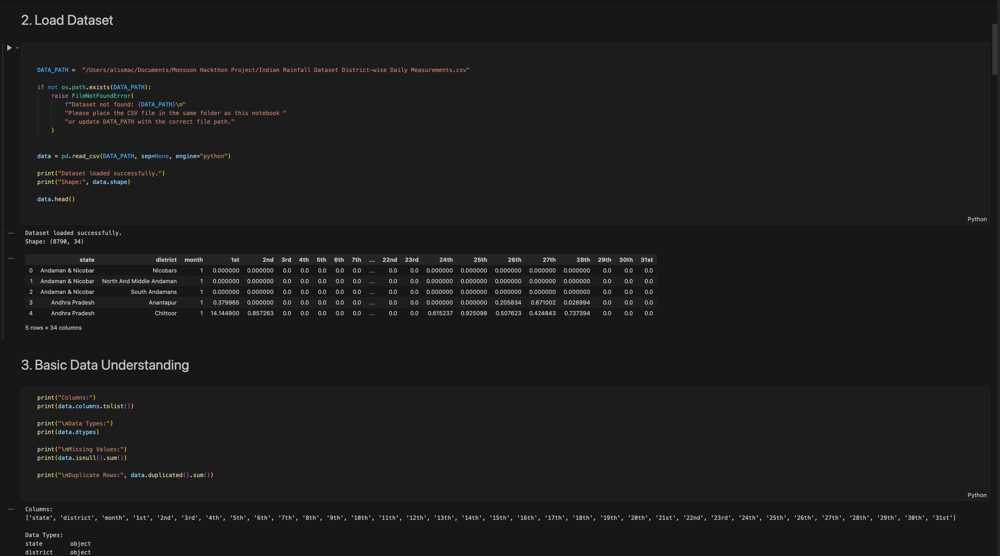

# Indian Rainfall Prediction App

This project predicts estimated total monthly rainfall for Indian districts using historical district-wise rainfall data and machine learning.

## Project Overview

The objective of this project is to analyze Indian district-wise daily rainfall data and build a machine learning model that predicts total monthly rainfall based on:

- State
- District
- Month

The final model is deployed using Streamlit for interactive predictions.

## Features

- Data cleaning and preprocessing
- Feature engineering
- Model training and comparison
- Random Forest based prediction model
- Streamlit dashboard for interactive prediction
- Model performance display

## Tech Stack

- Python
- Pandas
- NumPy
- Scikit-learn
- Joblib
- Streamlit
- Matplotlib / Seaborn

## Project Structure

```text
.
├── app.py
├── train_model.py
├── requirements.txt
├── imd_final.ipynb
├── Indian Rainfall Dataset District-wise Daily Measurements.csv
├── artifacts/
│   ├── rainfall_model.joblib
│   ├── metadata.json
│   └── model_results.csv
└── README.md


      